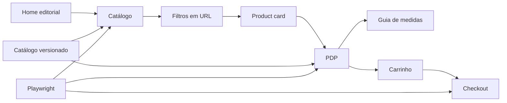

# Arquitetura

## Camadas

- `src/data`: catálogo versionado, tamanhos, cores e relações de produto.
- `src/lib`: formatação, filtros e recomendação de tamanho.
- `src/components`: componentes reutilizáveis e estados client-side.
- `src/app`: rotas Next.js para home, catálogo, PDP e checkout.
- `tests/e2e`: funil crítico automatizado.

## Trade-offs

- O MVP usa dados locais para garantir demo pública estática no GitHub Pages.
- O carrinho fica em `localStorage`, suficiente para protótipo e teste de UX.
- A recomendação de tamanho usa regra transparente para facilitar entrevista técnica.
- Micro frontends, CMS e pagamento real ficam fora do MVP para evitar complexidade desnecessária.
